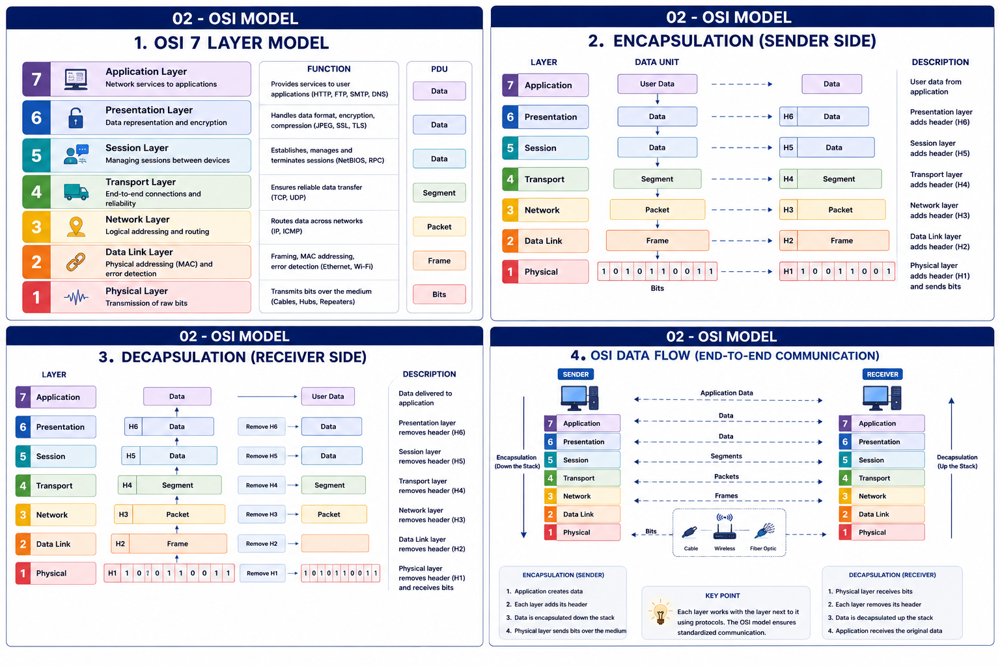

# OSI Model Layers




The **OSI (Open Systems Interconnection) Model** consists of **7 layers**.

Each layer performs a specific task and communicates with the layer directly above and below it.

---

# OSI Model Diagram

```
+-----------------------------+
| 7. Application Layer        |
+-----------------------------+
| 6. Presentation Layer       |
+-----------------------------+
| 5. Session Layer            |
+-----------------------------+
| 4. Transport Layer          |
+-----------------------------+
| 3. Network Layer            |
+-----------------------------+
| 2. Data Link Layer          |
+-----------------------------+
| 1. Physical Layer           |
+-----------------------------+
```

---

# Easy Mnemonic

Remember the layers from **Top to Bottom**

```
All
People
Seem
To
Need
Data
Processing
```

Application

Presentation

Session

Transport

Network

Data Link

Physical

---

# Layer 7 — Application Layer

## Purpose

Provides network services directly to end users and applications.

This is the layer where users interact with the network.

## Examples

- Google Chrome
- Gmail
- WhatsApp
- YouTube

## Protocols

- HTTP
- HTTPS
- FTP
- SMTP
- POP3
- IMAP

## Real World Example

You open Google Chrome and type:

```
www.google.com
```

This starts communication from the Application Layer.

---

# Layer 6 — Presentation Layer

## Purpose

Responsible for:

- Data Translation
- Encryption
- Decryption
- Compression

This layer ensures that data sent by one system can be understood by another.

## Examples

- SSL/TLS
- JPEG
- PNG
- GIF
- MP3

---

# Layer 5 — Session Layer

## Purpose

Creates,

Maintains,

Terminates communication sessions.

## Example

A Zoom meeting.

The Session Layer establishes the meeting, keeps it active, and closes it when finished.

---

# Layer 4 — Transport Layer

## Purpose

Provides reliable data delivery.

It breaks data into smaller pieces called Segments.

## Protocols

- TCP
- UDP

## Responsibilities

- Flow Control
- Error Control
- Reliability

## Real World Example

WhatsApp messages use TCP to ensure reliable delivery.

---

# Layer 3 — Network Layer

## Purpose

Responsible for finding the best path for data.

Uses IP Addresses.

## Devices

Router

## Protocols

- IPv4
- IPv6
- ICMP

---

# Layer 2 — Data Link Layer

## Purpose

Transfers data between devices on the same network.

Uses MAC Addresses.

## Devices

Switch

## PDU

Frame

---

# Layer 1 — Physical Layer

## Purpose

Responsible for transmitting raw bits over the communication medium.

## Devices

- Hub
- Repeater
- Cable

## PDU

Bits

---

# PDU (Protocol Data Unit)

| Layer | PDU |
|--------|-----|
| Application | Data |
| Presentation | Data |
| Session | Data |
| Transport | Segment |
| Network | Packet |
| Data Link | Frame |
| Physical | Bits |

---

# Devices Used

| Layer | Device |
|--------|---------|
| Physical | Hub |
| Data Link | Switch |
| Network | Router |

---

# Quick Revision Table

| Layer | Main Function |
|--------|---------------|
| Application | User Services |
| Presentation | Encryption & Compression |
| Session | Session Management |
| Transport | Reliable Delivery |
| Network | Routing |
| Data Link | MAC Addressing |
| Physical | Transmission of Bits |

---

# Key Points

✅ 7 Layers

✅ Router works at Layer 3

✅ Switch works at Layer 2

✅ Hub works at Layer 1

✅ TCP works at Layer 4

✅ HTTP works at Layer 7