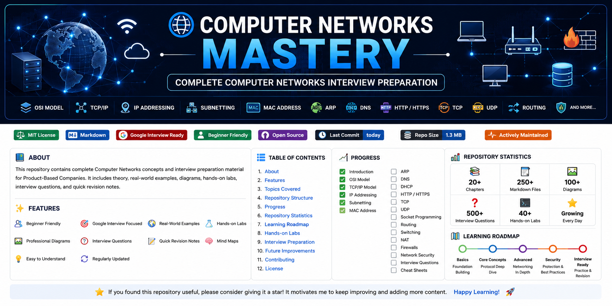

<p align="center">
  
</p>

<h1 align="center">🌐 Computer Networks Mastery</h1>

<p align="center">
A complete Computer Networks repository for Software Engineering interviews, Google SDE preparation, placements, and quick revision.
</p>

<p align="center">


</p>

---

# 📖 About

This repository is designed to help students and software engineers master **Computer Networks** from beginner to interview level.

It is specially created for:

- Google SDE
- Amazon SDE
- Microsoft
- Atlassian
- Adobe
- Walmart
- Product-Based Companies
- College Placements
- Computer Science Students

---

# 📊 Repository Statistics

| Metric | Count |
|---------|------:|
| 📁 Chapters | 20 |
| 📄 Markdown Files | 250+ |
| ❓ Interview Questions | 500+ |
| 🧪 Hands-on Labs | 40+ |
| 🌍 Real-World Examples | 100+ |
| 📋 Cheat Sheets | 20 |
| 🧠 Mind Maps | 20 |
| ⚡ Quick Revision Notes | 20 |
| ❌ Common Mistakes | 20 |
| 💬 FAQs | 20 |

---

# 📌 Repository Status

| Status | Value |
|--------|-------|
| 📚 Chapters | ✅ Complete |
| 🛠️ Actively Maintained | ✅ Yes |
| 🎯 Interview Ready | ✅ Yes |
| 🌍 Open Source | ✅ Yes |
| 📖 Beginner Friendly | ✅ Yes |

---

# 📚 Repository Structure

| Chapter | Topic |
|---------:|------------------------------|
| 01 | Introduction |
| 02 | OSI Model |
| 03 | TCP/IP Model |
| 04 | IP Addressing |
| 05 | Subnetting |
| 06 | MAC Address |
| 07 | ARP |
| 08 | DNS |
| 09 | DHCP |
| 10 | HTTP & HTTPS |
| 11 | TCP |
| 12 | UDP |
| 13 | Socket Programming |
| 14 | Routing |
| 15 | Switches & Routers |
| 16 | NAT |
| 17 | Firewalls |
| 18 | Network Security |
| 19 | Network Troubleshooting |
| 20 | Computer Networks Interview Revision |

---

# ✨ Features

- ✅ Beginner Friendly
- ✅ Google Interview Focused
- ✅ Real World Examples
- ✅ Hands-on Labs
- ✅ Interview Questions
- ✅ Quick Revision Notes
- ✅ Cheat Sheets
- ✅ Mind Maps
- ✅ Common Mistakes
- ✅ FAQs

---

# 🛣️ Learning Roadmap

```text
Introduction
      ↓
OSI Model
      ↓
TCP/IP Model
      ↓
IP Addressing
      ↓
Subnetting
      ↓
MAC Address
      ↓
ARP
      ↓
DNS
      ↓
DHCP
      ↓
HTTP & HTTPS
      ↓
TCP
      ↓
UDP
      ↓
Socket Programming
      ↓
Routing
      ↓
Switches & Routers
      ↓
NAT
      ↓
Firewalls
      ↓
Network Security
      ↓
Network Troubleshooting
      ↓
Interview Revision
```

---

# 📂 Folder Structure

```text
Computer-Networks-Mastery
│
├── assets/
│   └── banner.png
│
├── templates/
│
├── 01-Introduction
├── 02-OSI-Model
├── 03-TCP-IP-Model
├── 04-IP-Addressing
├── 05-Subnetting
├── 06-MAC-Address
├── 07-ARP
├── 08-DNS
├── 09-DHCP
├── 10-HTTP-HTTPS
├── 11-TCP
├── 12-UDP
├── 13-Socket
├── 14-Routing
├── 15-Switches-and-Routers
├── 16-NAT
├── 17-Firewalls
├── 18-Network-Security
├── 19-Network-Troubleshooting
├── 20-Computer-Networks-Interview-Revision
│
├── README.md
├── LICENSE
├── CHANGELOG.md
├── CONTRIBUTING.md
├── CODE_OF_CONDUCT.md
├── SECURITY.md
├── SUPPORT.md
├── .gitignore
└── create-chapter.ps1
```

---

# 💻 Who Is This Repository For?

- 👨‍🎓 Students
- 👨‍💻 Software Engineers
- 🌱 Beginners
- 💼 Placement Preparation
- 🚀 Google Interview Preparation
- 📚 Computer Science Learners

---

# ⭐ Interview Preparation

Every chapter includes:

- 📖 Theory
- 🖼️ Diagrams
- 💡 Real-World Examples
- 🧪 Hands-on Labs
- ❓ Google Interview Questions
- 📋 Cheat Sheets
- 🧠 Mind Maps
- ⚡ Quick Revision Notes

---

# 📈 Skills Covered

- Networking Fundamentals
- OSI Model
- TCP/IP Model
- IPv4 & IPv6
- Subnetting
- MAC Address
- ARP
- DNS
- DHCP
- HTTP & HTTPS
- TCP
- UDP
- Socket Programming
- Routing
- Switches & Routers
- NAT (Network Address Translation)
- Firewalls
- Network Security
- Network Troubleshooting

---

# 🚀 How to Use

1. Start with **Chapter 1 – Introduction**.
2. Study every chapter in order.
3. Complete all hands-on labs.
4. Practice interview questions.
5. Revise using Cheat Sheets and Mind Maps.
6. Use Quick Revision notes before interviews.

---

# 🌟 Repository Highlights

- 📘 20 Structured Chapters
- 🎯 Google Interview Focused
- 🧪 Practical Hands-on Labs
- 🌍 Real-World Examples
- ❓ 500+ Interview Questions
- 📋 Cheat Sheets
- 🧠 Mind Maps
- ⚡ Quick Revision Notes
- 💬 FAQs
- ❌ Common Mistakes

---

# 🤝 Contributing

Contributions are always welcome!

Please read **CONTRIBUTING.md** before opening a Pull Request.

---

# 👨‍💻 Author

**Saikumar Kadiri**

- GitHub: https://github.com/kadirisaikumar3
- LinkedIn: https://www.linkedin.com/in/saikumar-kadiri/

---

# 📜 License

This project is licensed under the **MIT License**.

---

# ⭐ Support the Project

If you found this repository helpful:

- ⭐ Star this repository
- 🍴 Fork it
- 📢 Share it with others
- 💡 Suggest improvements

Thank you for your support!

Happy Learning! 🚀